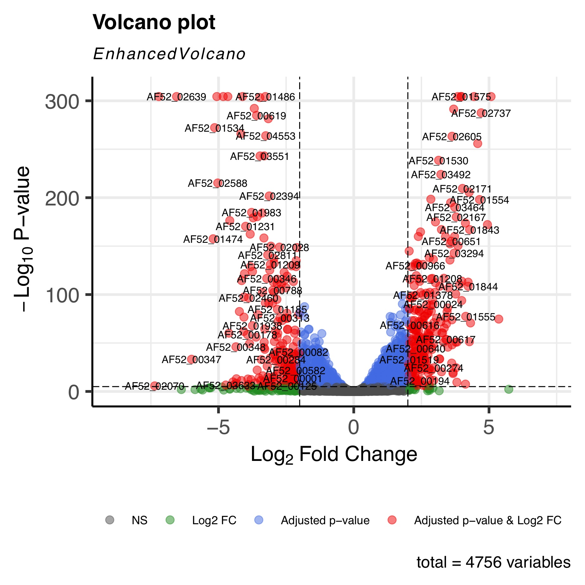
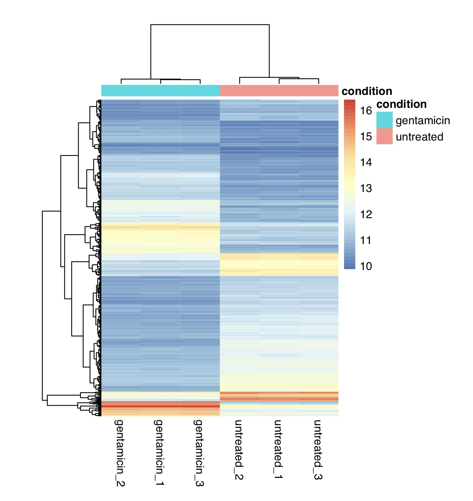
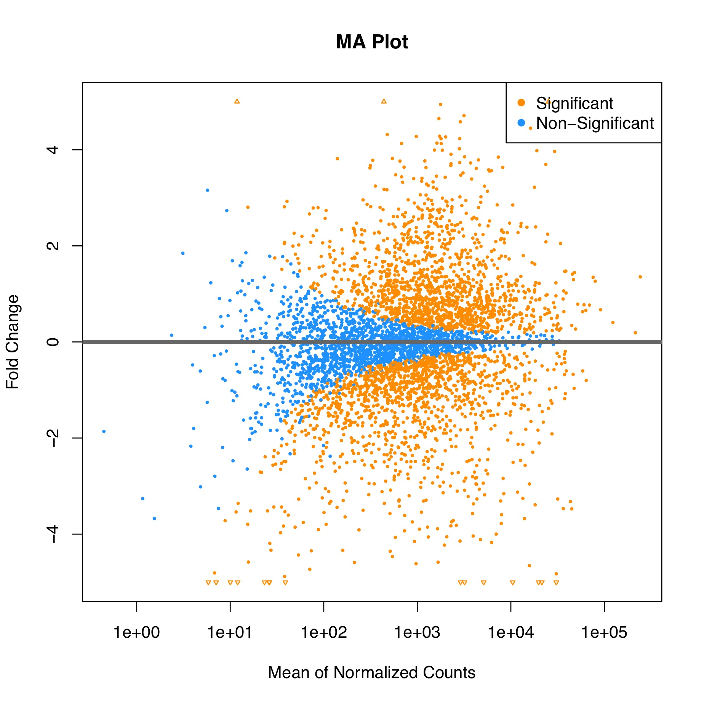

<div align="center">
    <h1>
    RNA-Seq and Gene Differential Expression Analysis
    </h1>
    <p>
    Project of BIO2503, 2024 Spring, SJTU
    <br />
    <a href="https://github.com/xywawawa"><strong>xywawawa</strong></a>
    &nbsp;
    <a href="https://github.com/Cannizzaro-reaction"><strong>Cannizzaro-reaction</strong></a>
    &nbsp;
    </p>
    <p>
    <a href="https://github.com/Cannizzaro-reaction/RNA-seq_workflow"></a>
    <a href="https://github.com/Cannizzaro-reaction/RNA-seq_workflow?tab=MIT-1-ov-file"></a>
    </p>
    
</div>


## 摘要

本流程利用 RNA-seq 对肺炎克雷伯菌（Klebsiella pneumoniae）在庆大霉素处理前后的基因表达差异进行了分析。通过比较经过庆大霉素处理与未经过处理的六组样本，揭示了基因表达水平的显著变化，旨在理解抗生素对细菌基因表达的影响。工作流程主要包括利用 anaconda 构建计算环境，进行质量控制、序列剪切、比对等 RNA 序列上游分析，进行 RNA 序列下游分析筛选显著差异表达的基因和展示基因表达的整体变化趋势。


## 前言

肺炎克雷伯菌（Klebsiella pneumoniae）是一种重要的病原菌，常导致医院感染及社区获得性感染，具有较强的抗药性。庆大霉素是一种广泛使用的氨基糖苷类抗生素，对多种细菌具有强效的抑制作用。RNA-seq 是一种高通量测序技术，用于研究转录组的复杂性和动态变化。作为一种强大的工具，RNA-seq 能够同时测量数千个基因的表达水平，提供关于基因表达、可变剪接、新的转录本和转录起始位点的信息。本流程通过比较庆大霉素处理前后的基因表达水平，揭示基因表达的动态变化，从而帮助理解基因调控机制。


## 数据与方法

### 分析工具

1. SRA Toolkit：一系列用于检索、转换、处理和分析来自 Sequence Read Archive（SRA）数据的工具。在此工作流程中，使用了 `prefetch` 下载 NCBI 中的 SRR 数据，并用 `fasterq-dump` 将 SRA 数据转换为 fastq 格式。

2. Trim Galore：包含 `FastQC`，用于高通量序列数据的质量控制程序，使用 FastQC 对下载的六组 SRR 数据进行质量分析。且可用于对 fastq 格式的文件进行序列剪切，去除低质量末端和接头序列。

3. BWA：一个用于DNA序列比对的软件包，它主要用于将短读序列比对到参考基因组上，利用 BWT 算法和 suffix array 实现快速匹配。

4. Samtools：用于将 `.sam` 和 `.bam` 格式的文件相互转换，利用 `.bam` 格式的文件提高计算效率，且可用于构建 `.bam` 文件的索引。

5. Featurecounts：利用参考基因组注释文件，对感兴趣的基因组特征（通常为外显子、基因、启动子等区域）进行记数，用于下游分析。

6. R：利用 `DESeq2`、`EnhancedVolcano`、`pheatmat`、`ggplot2` 等 R 包，通过输入的基因表达量矩阵进行计算，得到差异基因表达计算结果，并进行绘图。

   

### 原始数据

1. RNA测序结果原始数据：共六组，分别为经过或未经过庆大霉素处理的肺炎克雷伯菌RNA测序结果。下载自美国国家生物技术信息中心（NCBI）数据库，样本编号：SRR15174659，SRR15174661，SRR15174663，SRR15174670，SRR15174671，SRR15174672，均来自于项目PRJNA747165（GEO: GSE180237）。数据信息如下：

   | 编号        | 物种                  | 处理情况   | 重复序号 |
   | ----------- | --------------------- | ---------- | -------- |
   | SRR15174659 | Klebsiella pneumoniae | untreated  | rep1     |
   | SRR15174661 | Klebsiella pneumoniae | untreated  | rep2     |
   | SRR15174663 | Klebsiella pneumoniae | untreated  | rep3     |
   | SRR15174670 | Klebsiella pneumoniae | gentamicin | rep1     |
   | SRR15174671 | Klebsiella pneumoniae | gentamicin | rep2     |
   | SRR15174672 | Klebsiella pneumoniae | gentamicin | rep3     |

2. 参考基因组数据：用于RNA测序数据的比对，包括参考基因组序列（`.fna`）和基因组注释（`.gtf`），下载自NCBI，序号为GCF_000694555.1。

   

### 计算环境

* `rna_seq` 环境：主要用于数据下载和上游分析。添加上海交通大学 anaconda 镜像后配置该环境。

具体安装的软件及版本如下：

| package     | version |
|:-----------:|:-------:|
| SRA-Tools   | 2.8.0   |
| Subread     | 2.0.6   |
| Trim-Galore | 0.6.10  |
| BWA         | 0.7.18  |
| Samtools    | 1.3.1   |
| FastQC      | 0.12.1  |

* `r_env` 环境：用于运行 R 脚本，分析基因表达差异，并绘图。安装基础 R 包，以及 `DESeq2`、`EnhancedVolcano`、`pheatmat`、`ggplot2` 等差异分析需要的包，具体版本如下：

| package         | version |
|:---------------:|:-------:|
| BioManager      | 1.30.23 |
| DESeq2          | 1.42.1  |
| EnhancedVolcano | 1.20.0  |
| pheatmat        | 1.0.12  |
| ggplot2         | 3.5.1   |


**操作过程：**

可以通过运行脚本 `environment_setup.sh` 安装所需要的环境 `rna_seq` 和 `r_env`。若部分 R 包安装不成功，可以尝试在命令行中进入 R 交互环境手动运行以下命令安装：

* 设置 CRAN 镜像：

  ```R
  options(repos = c(CRAN = "https://mirrors.tuna.tsinghua.edu.cn/CRAN/"))
  ```

* 安装 `BioManager` 包：

  ```R
  install.packages("BiocManager")
  ```

* 利用 `BioManager` 安装 `DESeq2` 包：

  ```R
  BiocManager::install("DESeq2")
  ```

* 安装其余的 CRAN 包：

  ```R
  install.packages("EnhancedVolcano")
  install.packages("pheatmap")
  install.packages("ggplot2")
  ```

* 检测所有的包是否已经成功安装：

  ```R
  library(DESeq2)
  library(EnhancedVolcano)
  library(pheatmap)
  library(ggplot2)
  ```

  

### 分析流程

* RNA 序列上游分析
  * 构建工作目录
    
  * 利用prefetch下载六组RNA测序数据，并利用fasterq-dump将格式转换为 `.fastq`
    
  * 下载参考基因组序列（`.fna`文件）与基因组注释文件（`.gtf`文件），并解压
    
  * 将两个参考基因组文件利用 fasterq-dump 转换为 `.fastq`
    
  * 利用 FastQC 对六组 RNA 测序数据进行质量检测，生成质量分析报告
    
  * 利用 Trim Galore 对原始序列进行剪切，去除低质量序列与接头
    
  * 利用 BWA 将六组测序数据对应到参考基因组序列上，生成 `.sam` 比对文件
    
  * 利用 Samtools 将 `.sam`文件转化为 `.bam` 文件，进行排序，并构建索引
    
  * 利用 FeatureCounts，对排序后的 `.bam` 文件进行基因表达记数，得到表达量矩阵
    
  * 去除中间文件
  
* RNA 序列下游分析
  * 将表达量矩阵进行处理，去除不需要的列，作为后续R脚本的输入
  * 运行R脚本，加载所需要的包
  * 输入原始数据，设置样本信息，构建 DataFrame
  * 使用表达量数据和样本信息，构建 DESeq 数据集
  * 数据预处理，包括去除总数过低的基因，利用 DESeq 函数将数据归一化，并进行差异分析
  * 得到差异分析结果，进行排序
  * 设置参数，绘制火山图，展示显著差异基因的分布
  * 筛选显著差异表达的基因，绘制热图，展示这些基因在不同样本间的表达模式
  * 绘制 MA 图，可视化展示基因表达变化和显著性
  * 输出差异分析结果的数据和图

**操作过程：**

环境配置完成后，在脚本所在目录下运行脚本 `workflow.sh` 即可完成上述分析流程：

```shell
chmod +x workflow.sh
./workflow.sh
```

完成分析后，得到工作目录如下：

```shell
├── database # raw data and the index for reference genome
│   ├── raw_counts.txt
│   ├── reference.fna
│   ├── reference.fna.amb
│   ├── reference.fna.ann
│   ├── reference.fna.bwt
│   ├── reference.fna.pac
│   ├── reference.fna.sa
│   ├── reference.gff
│   └── reference.gtf
├── deseq_analysis.R
├── environment_setup.sh
├── result
│   ├── bam # bam files created after comparison
│   │   ├── SRR15174659_alignment.bam
│   │   ├── SRR15174659_sorted.bam
│   │   ├── SRR15174659_sorted.bam.bai
│   │   ├── SRR15174661_alignment.bam
│   │   ├── SRR15174661_sorted.bam
│   │   ├── SRR15174661_sorted.bam.bai
│   │   ├── SRR15174663_alignment.bam
│   │   ├── SRR15174663_sorted.bam
│   │   ├── SRR15174663_sorted.bam.bai
│   │   ├── SRR15174670_alignment.bam
│   │   ├── SRR15174670_sorted.bam
│   │   ├── SRR15174670_sorted.bam.bai
│   │   ├── SRR15174671_alignment.bam
│   │   ├── SRR15174671_sorted.bam
│   │   ├── SRR15174671_sorted.bam.bai
│   │   ├── SRR15174672_alignment.bam
│   │   ├── SRR15174672_sorted.bam
│   │   └── SRR15174672_sorted.bam.bai
│   ├── expression # results for gene differential expression analysis
│   │   ├── Rplots.pdf
│   │   ├── counts.txt
│   │   ├── counts.txt.summary
│   │   ├── differential_expression_results.csv
│   │   └── raw_counts.txt
│   ├── qc # quality reports
│   │   ├── SRR15174659_fastqc.html
│   │   ├── SRR15174659_fastqc.zip
│   │   ├── SRR15174661_fastqc.html
│   │   ├── SRR15174661_fastqc.zip
│   │   ├── SRR15174663_fastqc.html
│   │   ├── SRR15174663_fastqc.zip
│   │   ├── SRR15174670_fastqc.html
│   │   ├── SRR15174670_fastqc.zip
│   │   ├── SRR15174671_fastqc.html
│   │   ├── SRR15174671_fastqc.zip
│   │   ├── SRR15174672_fastqc.html
│   │   └── SRR15174672_fastqc.zip
│   └── trim # fastq files after trimming and trim reports
│       ├── SRR15174659.fastq_trimming_report.txt
│       ├── SRR15174659_trimmed.fq
│       ├── SRR15174661.fastq_trimming_report.txt
│       ├── SRR15174661_trimmed.fq
│       ├── SRR15174663.fastq_trimming_report.txt
│       ├── SRR15174663_trimmed.fq
│       ├── SRR15174670.fastq_trimming_report.txt
│       ├── SRR15174670_trimmed.fq
│       ├── SRR15174671.fastq_trimming_report.txt
│       ├── SRR15174671_trimmed.fq
│       ├── SRR15174672.fastq_trimming_report.txt
│       └── SRR15174672_trimmed.fq
└── workflow.sh

6 directories, 59 files
```


## 分析结果

* FastQC 对高通量测序结果进行质量控制与分析，本项目中的四个样本通过 FastQC 分析大致结果如下：

  | 文件名      | 总序列数   | 序列长度 | GC含量(%) | 每碱基序列质量 | 每序列质量得分 | 每碱基序列内容 | 每序列GC含量 | 每碱基N含量 | 序列长度分布 | 序列重复水平 | 过度表达序列 | 接头污染 |
  | ----------- | ---------- | -------- | --------- | -------------- | -------------- | -------------- | ------------ | ----------- | ------------ | ------------ | ------------ | -------- |
  | SRR15174659 | 10,352,833 | 42-91    | 53        | FAIL           | PASS           | FAIL           | FAIL         | PASS        | WARNING      | WARNING      | WARNING      | PASS     |
  | SRR15174661 | 6,261,246  | 42-91    | 53        | PASS           | PASS           | WARNING        | PASS         | PASS        | PASS         | WARNING      | WARNING      | PASS     |
  | SRR15174663 | 8,955,538  | 42-91    | 53        | FAIL           | PASS           | FAIL           | FAIL         | PASS        | WARNING      | WARNING      | WARNING      | PASS     |
  | SRR15174670 | 10,419,536 | 42-91    | 53        | FAIL           | PASS           | WARNING        | WARNING      | PASS        | WANING       | PASS         | WARNING      | PASS     |
  | SRR15174671 | 9,348,808  | 42-91    | 53        | FAIL           | PASS           | WARNING        | PASS         | PASS        | WARNING      | PASS         | WARNING      | PASS     |
  | SRR15174672 | 13,897,623 | 42-91    | 53        | FAIL           | PASS           | WARNING        | PASS         | PASS        | WARNING      | PASS         | WARNING      | PASS     |

  * 六个样本中有五个每碱基序列质量较低，且在某些特定的碱基位置质量得分急剧下降，这可能是由于这些部分出现在测序的末端。需要在后续对序列进行修剪和过滤，去除特定读段。
  * 有两个样本每碱基序列内容存在一定问题，可能是由于测序读段的前几位或末尾可能存在引物或接头残留。
  * 每序列 GC 含量可以反映测序样品是否被污染，或测序平台的测序质量。有两个样本 GC 含量存在一定问题，这可能是由于文库构建过程中存在对特定 GC 含量区域的偏好性导致。
  * 其余几项质量检查中不存在明显问题。

* 序列修剪得主要结果如下：

  | 样品编号    | 序列总长   | 修剪长度            | 接头序列      | 修建次数 | 读取保留 |
  | ----------- | ---------- | ------------------- | ------------- | -------- | -------- |
  | SRR15174659 | 10,352,833 | 830,606 bp (0.1%)   | AGATCGGAAGAGC | 2843897  | 98.2%    |
  | SRR15174661 | 6,261,246  | 488,409 bp (0.1%)   | AGATCGGAAGAGC | 1974707  | 95.5%    |
  | SRR15174663 | 8,955,538  | 747,628 bp (0.1%)   | AGATCGGAAGAGC | 2506534  | 98.3%    |
  | SRR15174670 | 10,419,536 | 794,706 bp (0.1%)   | AGATCGGAAGAGC | 3176934  | 97.4%    |
  | SRR15174671 | 9,348,808  | 703,645 bp (0.1%)   | AGATCGGAAGAGC | 2746868  | 98.9%    |
  | SRR15174672 | 13,897,623 | 1,113,224 bp (0.1%) | AGATCGGAAGAGC | 4098886  | 98.6%    |

  * 以上六个样品修剪后保留的序列长度均大于95%，修剪掉的低质量序列较少（0.1%），表示序列质量好，可用于后续分析。

* 参考序列比对的主要结果如下：

  | 样品编号    | 映射读取数 | 映射占比 |
  | ----------- | ---------- | -------- |
  | SRR15174659 | 19990854   | 99.60%   |
  | SRR15174661 | 11721550   | 99.39%   |
  | SRR15174663 | 17306594   | 99.60%   |
  | SRR15174670 | 19938227   | 99.61%   |
  | SRR15174671 | 18151821   | 99.63%   |
  | SRR15174672 | 26925131   | 99.54%   |

  * 六个样本均有99%的序列可以比对到参考基因组上，表明测序和比对质量良好。

* 基因差异表达分析：

  基因表达差异分析指比较不同条件或不同组别样本中的基因表达水平，以识别在不同条件下显著变化的基因，在功能基因组学研究中非常重要。本项目对比了未经处理与经过庆大霉素处理的细胞基因表达差异，可以识别出在庆大霉素处理后显著上调或下调的基因。这些基因可能与庆大霉素的作用机制、细胞应答或抗药性相关。
  
  本项目利用火山图、热图即 MA 图将基因表达的差异进行了可视化：
  
  
  
  
  * 火山图中的每个点表示一个基因，X 轴表示基因表达水平的变化倍数（log2 Fold Change），Y 轴表示P值的负对数（-log10 P-value），即统计显著性。图中红色点表示在庆大霉素处理后表达显著且变化较大的基因，其中右侧为上调，左侧为下调。
  * 在热图中，每一行通常代表一个基因，每一列通常代表一个样本或条件。基因高表达用暖色表示，低表达用冷色表达。图中对列进行聚类，使得表达模式相似的基因和样本聚集在一起。图中可见多块基因颜色存在差异，可知庆大霉素对这些基因存在显著影响。
  * 在 MA 图中，X 轴表示表示基因表达的平均值，Y 轴表示表示基因表达水平的变化倍数。存在显著差异的的基因可能用橙色表示，而非显著的基因用蓝色表示。可见庆大霉素处理后基因表达发生显著变化的基因占比较大，表达水平较高。
  * 综上，庆大霉素处理肺炎克雷伯菌可以对基因表达产生显著影响。可根据存在显著差异的基因进一步研究药物的作用机制。


## 讨论

* 目前基因的注释文件中只含有基因编号，需要根据表达差异显著的基因编号进一步查找基因。如果可以将基因编号与基因（蛋白质）名称进行对应，使火山图中直接显示基因名称，会更加直观。

* 未经处理和经庆大霉素处理的样本组内重复次数较少，可能会对结果的稳定性产生一定影响。

  

## 参考文献

[1] Peijun Ma, Haley M. Amemiya, Lorrie L. He, et al. Bacterial droplet-based single-cell RNA-seq reveals antibiotic-associated heterogeneous cellular states. *Cell*, 186(4), pp 877-891.

[2] Stark, R., Grzelak, M. & Hadfield, J. RNA sequencing: the teenage years. *Nat Rev Genet* 20, 631–656 (2019).

[3] Conesa, A., Madrigal, P., Tarazona, S. *et al.* A survey of best practices for RNA-seq data analysis. *Genome Biol* 17, 13 (2016).


## 附录

核心代码和脚本文件地址：[Cannizzaro-reaction/RNA-seq_workflow: course project for BIO2503 (github.com)](https://github.com/Cannizzaro-reaction/RNA-seq_workflow)
